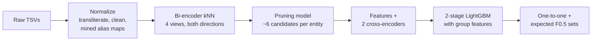

# Amazon ML Challenge 2026: Business Entity Resolution

My solution to the Business Entity Resolution task of the Amazon ML Challenge 2026. The competition
ran for three days; I gave myself 24 hours, start to finish.

Write-up: [Amazon ML Challenge 2026 in a Self-Imposed 24 Hours: 0.988216 F0.5](https://arneshbanerjee.dev/blog/amazon-ml-challenge-2026.html)

The task: business records come from three independent sources with no shared IDs. Source 1 is a
clean reference list. For every Source 1 business, find every record in Source 2 and Source 3 that
refers to the same real business. Names and addresses are noisy (typos, abbreviations, reordered
address parts, names in Indian scripts, missing fields), and many records are near copies of a real
business that belong to nobody. The test set also contains a country (France) that never appears in
the training data.

Scoring is F0.5 per Source 1 entity, averaged over all entities, so a wrong match costs more than a
missed one. The size of the candidate set produced by blocking was also part of the final review.

## Results

| | Score |
|---|---|
| Final overall score, macro F0.5 | **0.988216** |
| Holdout (train entities never used for training), tuning part | 0.99254 |
| Holdout, untouched part | 0.99219 |
| Blocking recall on the holdout, one run | 99.82% of true pairs, 5.8 candidates per entity |

The holdout covers US and India only, since France has no labels. The gap between the holdout and
the final score is mostly France (see [Limitations](#limitations)).

## How it works



1. **Normalization.** Unicode cleanup, transliteration of Indian scripts to Latin, removal of junk
   such as `-- `, `| www.x.com` and `null`, legal forms (LLC, Pvt Ltd, SARL) split into their own
   field, and address cleanup. Maps for native-script words, state names and street abbreviations are
   mined from matched training pairs, not written by hand.
2. **Candidate generation.** `multilingual-e5-small` is fine-tuned as a bi-encoder in two rounds (in-batch
   negatives, then mined hard negatives). Every record is encoded in four views (full record, name only,
   address only, first-round model), and exact GPU kNN runs inside each country in both directions:
   entity to records, and record to entities. A small LightGBM model then cuts the union to about 6
   candidates per entity. Its output is `candidate_pairs.tsv`.
3. **Matching.** For every candidate pair: rapidfuzz string scores on names, core names and addresses,
   idf-weighted token overlap, house number and phone checks, bi-encoder cosines, and scores from two
   `mdeberta-v3-base` cross-encoders (one on normalized text, one on raw text). A LightGBM stacker
   combines them. A second stage adds group features: does this record agree with the other confident
   records of the same entity, and how strongly does a different entity compete for it?
4. **Final sets.** In the training data, every Source 2 / Source 3 record belongs to at most one
   entity, so each record is kept only for the entity where it scores highest. Probabilities are
   calibrated (isotonic), and for each entity the pipeline picks the top-k set, empty set included,
   with the highest expected F0.5.
5. **Two runs.** The whole pipeline is trained twice with different seeds. For US and India the two
   runs' scores are averaged. For France the output keeps only the pairs that both runs accept.

The full write-up, with the data analysis, feature list and error analysis, is in
[Documentation.md](Documentation.md). Scores from the competition are in [RESULTS.md](RESULTS.md).

## Data

The dataset is not included. It comes from the competition. The code expects this layout:

```
dataset/
├── train/  train_source1.tsv  train_source2.tsv  train_source3.tsv  train_ground_truth.tsv
└── test/   test_source1.tsv   test_source2.tsv   test_source3.tsv
```

Each source file has the columns `entity_id`, `business_name`, `business_address` and `country`.
The ground truth has `source1_entity_id` and `matched_entity_ids` (comma separated). About 2.2M
Source 1 entities and 10.3M Source 2 / Source 3 records in train, and 1.7M and 10M in test.

## Requirements

- Linux, Python 3.12, one NVIDIA GPU with at least 40 GB of memory.
- About 100 GB of RAM and 150 GB of free disk for intermediate files.
- [uv](https://docs.astral.sh/uv/) for the environment.
- Internet access once, to download two pretrained models:
  `intfloat/multilingual-e5-small` and `microsoft/mdeberta-v3-base` (both MIT).

## Setup

```bash
git clone https://github.com/ArneshBanerjee/amazon-ml-challenge-2026-entity-resolution.git
cd amazon-ml-challenge-2026-entity-resolution
uv venv --python 3.12 .venv
uv pip install --python .venv/bin/python -r requirements.txt \
    --extra-index-url https://download.pytorch.org/whl/cu126 --index-strategy unsafe-best-match
```

## Run

The final output (two runs, averaged):

```bash
PY=$PWD/.venv/bin/python bash src/run_ensemble.sh /path/to/dataset /path/to/output
```

A single run takes about half the time and scores about 0.0002 lower on the holdout:

```bash
PY=$PWD/.venv/bin/python bash src/run_all.sh /path/to/dataset /path/to/output
```

Both write `matching_results.tsv` and `candidate_pairs.tsv` to the output folder. One run takes 8 to
10 hours on one GPU, mostly transformer training and inference. Intermediate files go to
`artifacts/` (and `artifacts_run2/` for the second run). Every stage skips work whose output already
exists, so after an interruption the same command continues where it stopped.

Settings:

| Variable | Meaning |
|---|---|
| `BER_DATA` | dataset folder (set by the run scripts from the first argument) |
| `BER_ART` | folder for intermediate files |
| `BER_SEED` | run seed (0 for the first run, 1 for the second) |
| `BER_THREADS` | LightGBM threads, default all cores but two |

LightGBM slows down sharply when its threads have to compete for CPU cores, which is why it leaves
two cores free by default. Lower `BER_THREADS` if the machine has fewer cores to spare.

## Code

All code is in `src/`.

| Script | What it does |
|---|---|
| `load.py` | Reads the TSVs with every column as a string, checks row counts, stores parquet. |
| `splits.py` | Splits train entities by country: A (80%, neural models), B (10%, stacker), C1 (8%, tuning), C2 (2%, untouched check). |
| `normalize.py` | Transliteration, junk removal, legal forms, alias names (dba, t/a, formerly), domains, address cleanup. Mines alias maps from split-A pairs. |
| `train_biencoder.py`, `encode.py`, `knn.py` | Bi-encoder training (two rounds), encoding of all records, exact GPU kNN in both directions. |
| `block.py`, `prune.py` | Candidate union (4 kNN views plus acronym and domain keys) and the LightGBM pruning model. |
| `features.py`, `featurize.py` | Pair features: string scores, idf overlaps, number checks, word-swap signal, rank and gap context. |
| `cross.py` | The two cross-encoders, trained on split-A candidate pairs. |
| `stack.py`, `group.py` | Two-stage LightGBM stacker (4-fold on split B) and the group features for stage 2. |
| `select_sets.py` | One-to-one assignment, calibration, expected-F0.5 set choice, writes both output files. |
| `ensemble.py`, `splice.py` | Averages the runs, then builds the final file by country. |
| `pseudo.py` | Optional step for countries without labels (`UNLABELED_STEP=1`), not used for the final output. |
| `evaluate.py` | Exact macro F0.5 (singletons included), blocking recall and candidates per entity. |
| `analyze.py`, `blockstats.py`, `transfer.py` | Error analysis and checks, not needed for the outputs. |

## Limitations

- **France.** With no French labels, the models rely on what transfers from US and India. The
  holdout says about 0.992 for those two countries, and the leaderboard suggests France is closer to
  0.96. French addresses often drop or swap the region, and French distractor words ("& Fils",
  "Groupe") differ from the English ones the model learned. `normalize.py` maps the common ones.
- **Records with no address.** When a record has only a name and several entities share that name,
  there is not enough information to pick one, so the pipeline predicts nothing for it.
- **Legal-form distractors.** A copy of a business with an extra "Inc" at the same address looks
  almost exactly like a normal noisy record, and some of these still get through.
- **Compute.** The full two-run pipeline needs about 16 to 20 GPU hours.

## Models and licenses

| Component | License |
|---|---|
| `intfloat/multilingual-e5-small` (118M parameters) | MIT |
| `microsoft/mdeberta-v3-base` (278M parameters) | MIT |
| LightGBM | MIT |

No external data was used: no geocoding, no business registries, no outside datasets.

This code is released under the MIT License (see [LICENSE](LICENSE)).
